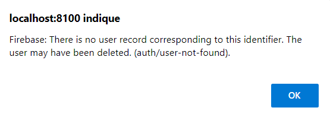
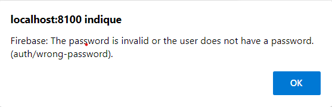

# TechFormating Application
Cette application mobile consiste a 

## L’application se présente avec un système d’authentification (SignIn + SignUp):

## Sign up :
L'interface qui permet aux clients de s’inscrire et accéder à l'application pour profiter de ses services (**les formations**), en saisissant les champs suivants: **l'adresse email et le password**

L'utilisateur doit entrer un email valide,  sinon un alert s’affiche lui indiquant comme suit:

## Sign In :
Les champs **email** et **password** nous permettent la connexion à l’application à travers l'interface **Sign In**:

L'utilisateur doit se conne cter avec un compte qui existe, sinon un alert s’affiche lui indiquant comme suit:

S'il se trompe dan le mot de passe, un alert s’affichera toujours :

