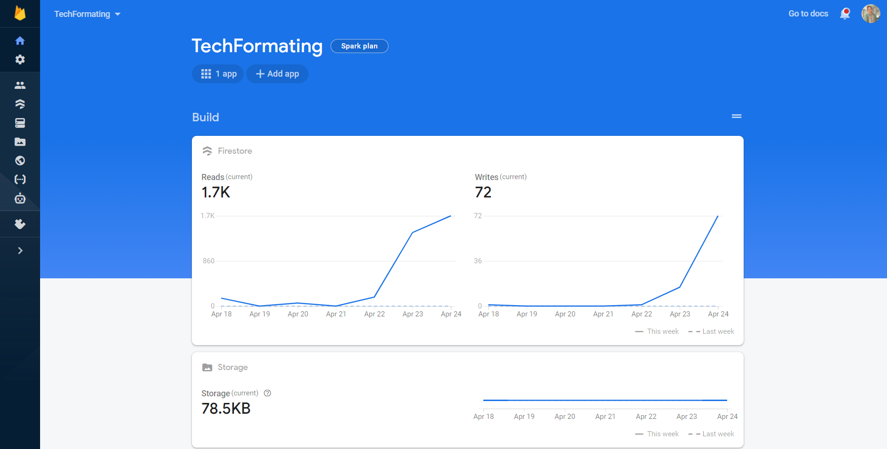

# TechFormating Application

## SOMMAIRE:

        - Présentation
        
        - Les interfaces de l’application
             1. L’ensemble des interfaces d’authentification: Sign up & Sign in
             2. L’interface d'Accueil
             3. L’interface Details
             4. L’interface Summary

        - Gestion de base de données:
             - Firebase
             
        - Technologies utilisées:
             - Angular
             - Ionic
             
        - Environnement et outils de travail:
             - VS Code
             - Firebase Console
           
## Présentation:
Cette application mobile consiste à créer une application mobile sous nom de **TechFormating**, sous forme d'une platforme de formations en programmation (**language et Framework**).

## Les interfaces de l’application: 

###### L’application se présente avec un système d’authentification (SignIn + SignUp):

## L'interface Sign up :
Cette interface permet à l'utilisateur de s’inscrire et accéder à l'application pour profiter de ses services (**les formations**), en saisissant les champs suivants: **l'adresse email et le password**

L'utilisateur doit entrer un email valide, sinon un alert s’affiche lui indiquant comme suit:

## L'interface Sign In :
Les champs **email** et **password** nous permettent la connexion à l’application à travers l'interface **Sign In**:

L'utilisateur doit se connecter avec un compte existant, sinon un alert s’affiche lui indiquant comme suit:

S'il se trompe dans le mot de passe, un alert s’affichera toujours :

L'utilisateur peut même se connecter avec **Google Provider** fournit par la platforme **Firebase**

## L'interface Accueil :
Cette interface affiche la liste (Ionic sliding list) des **formations** disponibles sur la platforme, il suffit de **Swipe left** et cliquer sur le boutton **More** pour avoir plus d'informations sur chaque formation.

En bas de l'interface, s'affiche des **Tabs** qui ramènent toujours à **l'interface d'acceuil** ou bien pour se deconnecter (**Logout**), l'utilisateur se trouve de nouveau dans l'interface de connexion: **Sign In**

## L'interface Details :
Affiche les details d'une formation:
_Une image representant la formation (le language)_
_Une petite description de la formation._
_La durée de la formation_
_Les prérequies que l'utilisateur doit maîtriser avant d'entamer la formation_
_Le prix de la formation_

Plus d'un boutton _**ENROLL NOW**_ pour s'inscrire à la formation.

Avant de s'inscrire à la formation, un **Alert de confirmation** s'affiche pour confirmer si l'utilisateur voudrais bien s'inscrire à cette formation.

## L'interface Summary:
Une fois l'utilisateur est inscrit à une certaine formation, cette interface lui affiche les informations de la formation qui a choisi, plus ses informations (**son adresse email**)

## Gestion de base de données:

**Firebase** est un ensemble de services d'hébergement pour n'importe quel type d'application (Android, iOS, Javascript, Node.js, Java, Unity, PHP, C++ ...). Il propose d'héberger en NoSQL et en temps réel des bases de données, du contenu, de l'authentification sociale (Google, Facebook, Twitter et Github), et des notifications, ou encore des services, par exemple un serveur de communication temps réel.

## Technologies utilisées:

**Angular** est un framework côté client, open source, basé sur TypeScript. Angular est une réécriture complète d'AngularJS.
Il permet la création d’applications Web et plus particulièrement de ce qu’on appelle des « Single Page Applications » : des applications web accessibles via une page web unique qui permet de fluidifier l’expérience utilisateur et d’éviter les chargements de pages à chaque nouvelle action. 
Le Framework est basé sur une architecture du type MVC et permet donc de séparer les données, le visuel et les actions pour une meilleure gestion des responsabilités.

**Ionic** est un framework open-source créé en 2013 par Max Lynch, Ben Sperry, et Adam Bradley.
Basé initialement sur AngularJS et Apache Cordova2, Ionic permet de créer un code multisupport en utilisant des outils Web comme HTML, CSS, JavaScript, afin de générer des applications iOS, Android, Chrome, Windows Phone et bien d'autres.

## Environnement et outils de travail:

**Visual Studio Code** est un éditeur de code extensible développé par Microsoft pour Windows, Linux et macOS2.

**Firebase Console** 

