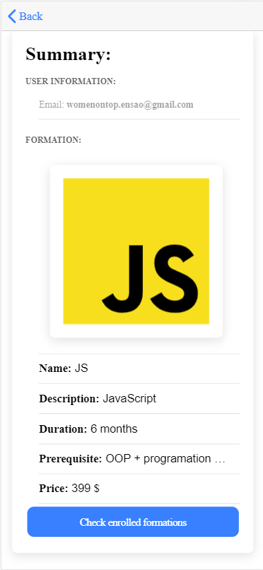

# TechFormating Application
Cette application mobile consiste a 

## L’application se présente avec un système d’authentification (SignIn + SignUp):

## L'interface Sign up :
L'interface qui permet aux clients de s’inscrire et accéder à l'application pour profiter de ses services (**les formations**), en saisissant les champs suivants: **l'adresse email et le password**

L'utilisateur doit entrer un email valide,  sinon un alert s’affiche lui indiquant comme suit:

## L'interface Sign In :
Les champs **email** et **password** nous permettent la connexion à l’application à travers l'interface **Sign In**:

L'utilisateur doit se conne cter avec un compte qui existe, sinon un alert s’affiche lui indiquant comme suit:

S'il se trompe dan le mot de passe, un alert s’affichera toujours :

L'utilisateur peut meme se connecter avec **Google Provider** fournit par la platforme **Firebase**

## L'interface Accueil :
Cette interface affiche la liste (Ionic sliding list) des **formations** disponibles sur la platforme, il suffit de **Swipe left** et cliquer sur le Boutton **More** pour avoir plus d'informations sur chaque formation.

En bas de l'interface, s'affiche des **Tabs** qui nous ramene toujours a **l'interface d'acceuil** ou bien pour se deconnecter (**Logout**)

## L'interface Details :
Affiche les details d'une formation:
_Une image representant la formation (le language)_
_Une petite description de la formation._
_La duree de la formation_
_Les prerequies que l'utilisateur doit metriser avant d'entamer la formation_
_Le prix de la formation_

Plus d'un boutton _**ENROLL NOW**_ pour s'inscrire a la formation.

Avant de s'inscrire a la formation, un **Alert de confirmation** s'affiche pour confirmer si l'utilisateur voudrais bien s'inscrire a cette formation.

## L'interface Summary:
Une fois l'utilisateur est inscrit a une certaine formation, cette interface lui affiche les nformation de la formation qui a choisi, plus ses informations (**son adresse email**)

